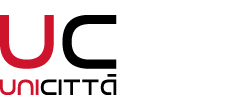

<a id="top"></a>

# SecurCity 2.0

<p align="center">
  
  <a href="https://github.com/ADreLOI/IS-Project-SECURCITY/stargazers"></a>
  <a href="https://github.com/ADreLOI/IS-Project-SECURCITY/graphs/contributors"></a>
  <a href="https://github.com/ADreLOI/IS-Project-SECURCITY/forks"></a>
  <a href="https://github.com/ADreLOI/IS-Project-SECURCITY/issues"></a>
  
  
  
</p>

<p align="center">
  
  
</p>

<p align="center">
  <a href="https://youtu.be/v4Zihx55A-w">
    
  </a>
</p>

<p align="center"><strong>Click the image to watch the video demo.</strong></p>

> A cross-platform safety companion for smarter, safer urban navigation. Built as Group 10's Software Engineering project at the University of Trento.

> **Recognition.** SecurCity was one of the six finalist projects in the University of Trento's *100 Progetti per Trento* challenge. [Read the University article](https://pressroom.unitn.it/comunicato-stampa/cento-progetti-trento-lapp-scudo-vince-la-nuova-sfida).

<details>
<summary><h2>Table of Contents 📖</h2></summary>

- [Overview](#overview)
- [Demo](#demo)
- [Key features](#key-features)
- [Architecture](#architecture)
- [Project structure](#project-structure)
- [Getting started](#getting-started)
- [Recognition](#recognition)
- [Acknowledgments](#acknowledgments)
- [Team](#team)
- [Repository topics](#repository-topics)
- [License](#license)

</details>

## Overview

**SecurCity** helps citizens reach destinations safely and confidently through intelligent route planning, real-time alerts, and collaboration with municipal operators.

The system combines a REST API, an operator-facing web interface, and a citizen-facing mobile app.

## Demo

Watch the complete [SecurCity video demo on YouTube](https://youtu.be/v4Zihx55A-w).

## Key features

- Safe route generation via Google Maps and real-time data
- Email and Google Sign-In authentication
- Anonymous crime reports and emergency-contact support
- Municipal dashboard for tokens, sensors, alerts, and report management
- Modular web, mobile, and backend architecture

## Architecture

```text
Web app (React + Expo)          Mobile app (React Native + Expo)
             \                         /
              \                       /
               -------- REST API -------
                         Express + Mongoose
```

Both clients communicate with the same API for route generation, user actions, and map data. The safe-routing logic is documented in [BackEnd/README.md](./BackEnd/README.md).

## Project structure

```text
FrontEnd/
  WebApp/          # React-based interface for municipal operators
  MobileApp/        # React Native app for citizens
BackEnd/            # Node.js REST API server
assets/             # Logos and static assets
LICENSE.txt         # AGPL-3.0 license
README.md           # Project overview
```

Each component has its own README with implementation-specific notes.

## Getting started

### Prerequisites

- Node.js and npm
- An instance of MongoDB for the backend
- Google OAuth, Maps, and SendGrid credentials where the corresponding features are enabled

### Configure the backend

```bash
cd BackEnd
cp .env.example .env
```

Fill in your own values in `.env`. Never commit credentials or a real administrator code.

### Web app

```bash
cd FrontEnd/WebApp
npm install
npx expo start -w
```

See [FrontEnd/WebApp/README.md](./FrontEnd/WebApp/README.md) for details. The historical course deployment is available at [is-project-securcity.onrender.com](https://is-project-securcity.onrender.com).

### Mobile app

```bash
cd FrontEnd/MobileApp
npm install
npx expo start
```

See [FrontEnd/MobileApp/README.md](./FrontEnd/MobileApp/README.md) for device and emulator notes.

### Backend API

```bash
cd BackEnd
npm install
npm run dev
```

See [BackEnd/README.md](./BackEnd/README.md) for endpoints and safe-routing details.

## Recognition

SecurCity placed **third among the projects selected from the Software Engineering course** and reached the **top 6% of 100 Progetti per il Comune di Trento**. [Read the official University of Trento press article](https://pressroom.unitn.it/comunicato-stampa/cento-progetti-trento-lapp-scudo-vince-la-nuova-sfida).

## Acknowledgments

SecurCity was developed for the **Software Engineering** course at the University of Trento under the supervision of [**Prof. Sandro Luigi Fiore**](https://webapps.unitn.it/du/it/Persona/PER0228723/Didattica), [**Prof. Chiara Di Francescomarino**](https://webapps.unitn.it/du/it/Persona/PER0025609/Didattica), and [**Prof. Marco Robol**](https://webapps.unitn.it/du/it/Persona/PER0049999/Didattica). We thank them for their guidance, technical feedback, and support throughout the project.

The project took part in **100 Progetti per il Comune di Trento**, an initiative promoted by the University of Trento and the Municipality of Trento within the **UniCittà** protocol. SecurCity placed **third among the projects selected from the Software Engineering course** and reached the **top 6% of the overall initiative**. See the [official University of Trento press article](https://pressroom.unitn.it/comunicato-stampa/cento-progetti-trento-lapp-scudo-vince-la-nuova-sfida).

<p align="center">
  <a href="https://r1.unitn.it/unicitta/">
    
  </a>
  &nbsp;&nbsp;&nbsp;&nbsp;
  <a href="https://www.comune.trento.it/">
    
  </a>
</p>

## Team

**Group 10**

| Member | GitHub | LinkedIn | Email |
| --- | --- | --- | --- |
| Andrea Lo Iacono | [ADreLOI](https://github.com/ADreLOI) | [Andrea Lo Iacono](https://www.linkedin.com/in/adreloi) | [andrea.loiacono@studenti.unitn.it](mailto:andrea.loiacono@studenti.unitn.it) |
| Matthew De Marco | [MattDema](https://github.com/MattDema) | [Matthew De Marco](https://www.linkedin.com/in/matt-de-marco/) | [matthew.demarco@studenti.unitn.it](mailto:matthew.demarco@studenti.unitn.it) |
| Andrea Pezzo | [AndreaP2203](https://github.com/AndreaP2203) | [Andrea Pezzo](https://www.linkedin.com/in/andrea-pezzo-34525b191) | [andrea.pezzo-1@studenti.unitn.it](mailto:andrea.pezzo-1@studenti.unitn.it) |

## Repository topics

`software-engineering` `smart-city` `public-safety` `react-native` `expo` `nodejs` `express` `mongodb` `google-maps` `university-of-trento`

## License

This project is licensed under the [AGPL-3.0 License](./LICENSE.txt).

The name **SecurCity**, its logo, and related branding are not covered by the AGPL license and remain Copyright 2025 Matthew De Marco, Andrea Lo Iacono, and Andrea Pezzo.

<p align="center">
  <a href="#top" style="text-decoration: none;">
    
    <br>
    <strong>Back to Top</strong>
  </a>
</p>

